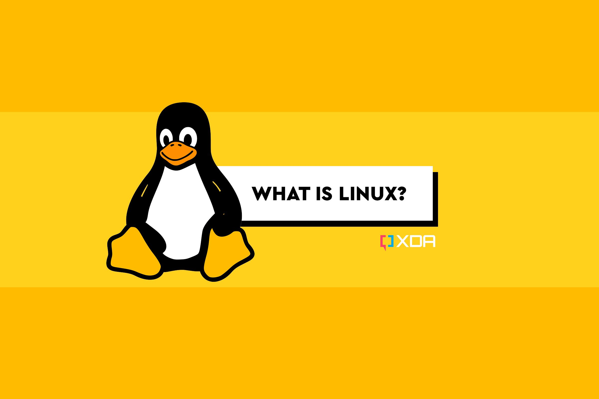
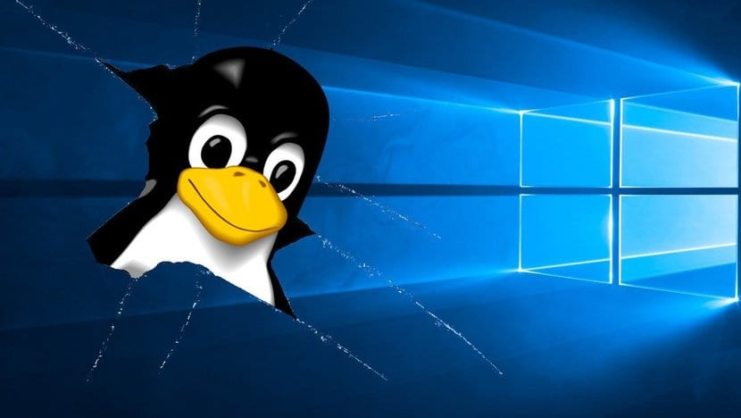
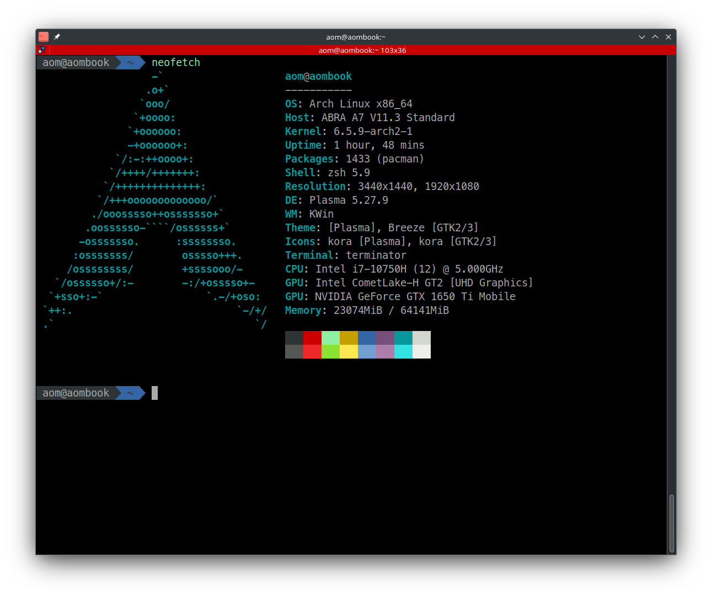
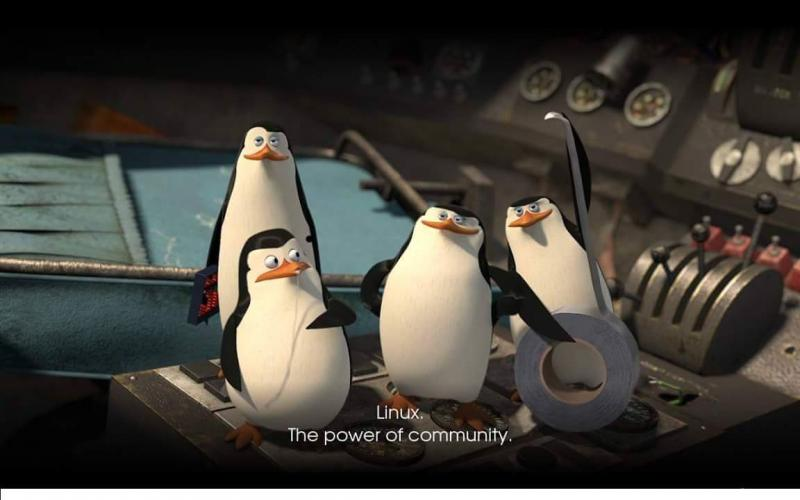

# Yeni Linux Kullanıcılarının Yaptığı En Önemli 10 Hata

Linux, Windows veya macOS kullanıcıları için ilginç bir deneyim olabilir. Temel bazı farklılıklar kafa karıştırıcı olabilir. 

Ama genel olarak gördüğüm Linux deneyimine yeni başlayanların kullanmanın zor olduğunu düşündüren bazı hatalar yaparlar. Ancak yeni Linux kullanıcıları, bazı süpriz kullanıcı deneyimi yaşatan şeyler yaşayabilirler.

Sizi suçlamıyorum. İlk başlayanlar da bu hatalardan bazılarını hep gördük ve çoğu kullanıcı için bu kaçınılmazdır diyebiliriz.

Ancak, neyi yanlış yaptığınızı öğrenirseniz, sorun her zaman çözülür.

Bu makalede tam olarak bunlara birkaç örnek vereceğiz.

## 1. Yanlış Donanım Seçmek

Eğer zaten bir bilgisayarınız ya da dizüstü bilgisayarınız varsa ve Linux'u denemek istiyorsanız, herşeyiniz hazır demektir.

Ancak Linux kullanmak istediğinizde donanım yapılandırmasını doğru yapmak çok önemlidir.

Genelde sıkıntı noktaları şunlardır:

En yeni ve en mükemmel donanıma sahip olduğunuzu düşünebilirsiniz.

Özellikle dizüstü bilgisayarlarda Windows'u çalıştırmak için özel olarak tasarlanmış bir ürün kullanıyorsunuz.

Seçtiğiniz donanım bileşenleri Linux ile en kötü uyumluluğa sahip olabilir.
Linux çok çeşitli donanımları desteklese de, belirli üreticiler, markalar ve bileşenler Windows'ta çalıştığı şekilde çalışmayabilir.

Örneğin, ASUS'un genellikle Windows için tasarlanmış bir dizüstü bilgisayarı, yeteneklerinden en iyi şekilde yararlanmak için Linux ile sorunsuz bir şekilde çalışmayabilir. Ancak HP, Dell ya da Lenovo'nun dizüstü bilgisayarlarının uyumluluk şansı daha yüksektir.

En çok sorun yaşanan ve sıklıkla çözüm üretmekde zorlanılan başka bir örnek de NVIDIA grafik kartlarıdır. Tüm Linux dağıtımlarıyla mükemmel çalışmaması gibi bir sorun maalesef var. Ama çözümsüz değil diyemeyiz.AMD grafik kartlarının ise daha iyi destek sunması olabilir.

Unutmayın. Sonuçta göreceğiniz şey Linux kelimenin tam anlamıyla her şeyde çalışabilir.

Ancak Linux'u denemeye karar vermeden önce donanım bileşenlerinizle uyumluluğunu kontrol etmenizde fayda var.

## 2. Linux'un Ne Olduğunu Bilmemek

Ubuntu gibi bir Linux dağıtımı kullanmanız önerilmiş olabilir. Bu yeni başlayanların nerdeyse çoğu için geçerlidir.

Peki, bu Linux mu? Hem evet hem hayır.

Linux'a yeni başladığınızda, bunalmak kolaydır.

Muhtemelen sadece Windows kullandınız, ancak şimdi Linux kullanmak istiyorsunuz çünkü Linux'un Windows'tan daha iyi olduğunu, daha güvenli olduğunu ve Linux kullanmak için **lisans satın almanız gerekmediğini** okudunuz. 

Ancak daha sonra Linux'u indirmeye ve kurmaya başladığınızda, Linux'un tek bir kavram olmadığını öğreniyorsunuz. ***Debian, Arch, Ubuntu, Fedora, Linux Mint, elementary*** ve yüzlerce başka **'Linux dağıtımı'** var. Sorun şu ki, bazıları tıpkı diğerlerine benziyor.

***Eğer durum buysa neden bu kadar çok Linux işletim sistemi var?***

Ve sonra Linux'un bir işletim sistemi değil, sadece bir **kernel** (çekirdek) olduğunu da öğreniyorsunuz.

Daha fazla derine girmeden devam edelim. Bu detayşarı ilerki zamanlarda daha fazla detaylandıracak konuları açarız.

## 3. Yanlış Dağıtımı Seçmek

Umarım Linux'un ne olduğu hakkındaki konsepti anlamışsınızdır. Esas mesele burda başlıyor.

Eğer anladıysanız, bilmek istediğiniz bir sonraki şey sisteminiz ve kullanım durumunuz için doğru Linux dağıtımını seçmektir.

Çoğu yeni Linux kullanıcısı gereksinimlerine uygun olmayan bir şey seçer ve hüsrana uğrar.

Genelde yeni başlayanların zorluk çekmeden alışmasını sağlayan Linux dağıtımları:

***Ubuntu (veya Ubuntu çeşitleri)***
***Linux Mint***
***Pop!_OS***

Tabiki çok daha fazla seçenek var, ama bir ısınma turu atmanın zararı olmaz.

Eğer maceraperest hissediyorsanız ve deneyiminiz için iyi bir meydan okuma istiyorsanız, **Arch Linux** ya da **Fedora** seçebilirsiniz. Benim şahsi tercihim **ARCH Linux**.

İleri düzey kullanıcılar için tasarlanmış dağıtımlardan herhangi birini seçmemelisiniz. Slackware, Void Linux, Gentoo gibi. Ama bir zaman gelecek onları da denemek isteyeceksiniz. 

Linux'un güzel ve ilginç yanı da budur. Sizi denemeye ve öğrenmeye teşvik eder. Kendinizi herzaman geliştirsiniz. Tabi amacınız bu ise.

## 4. Sonuçlara Varmadan Atlamak

Her şeyde olduğu gibi, biraz araştırma yapmanız ve ne kullanacağınızı ve işleri nasıl yapacağınızı öğrenmek için biraz zaman harcamanız gerekir. Sonuçta yeni öğrendiğiniz bir konu.

Uygulamaların nasıl yükleneceği, uygulamaların nasıl kaldırılacağı ve verilerinizin nasıl yedekleneceği gibi konular çok önemlidir.

***Araştırma için kaynakları inceleyebilirsiniz:**

[Ubuntu](https://help.ubuntu.com/stable/ubuntu-help/index.html)

[ARCH Linux](https://wiki.archlinux.org/title/Main_page_(T%C3%BCrk%C3%A7e))

[Fedora](https://docs.fedoraproject.org/tr/project/)

[Debian](https://www.debian.org/)

Mesele şu ki, bir konuda net değilseniz, sorunsuz bir deneyim için Linux'u kullanmaya başlamadan önce bu konuda bilgi edinin.

## 5. Windows Olmadığını Fark Etmek

Bazı kullanıcılar Windows alışkanlıkları ile aynı uygulamaların ya da şeylerin aynı şekilde çalışmasını beklerler.

Eğer halihazırda başka bir platform kullanıyorsanız ve iş akışınızı ya da üretkenliğinizi bozmak istemiyorsanız, Linux'a direkt geçmemeli ve ona bağlı kalmalısınız. Özellikle kullandığınız uygulamalar var ise onların Linux desteği olup olmadığına bakmalısınız. Mesela Adobe, Autocad gibi uygulamalar sıkıntı olacaktır. Yada sadece oyun oynuyorsanız Linux sizi uğraştırır. Ama bu belki de istediğiniz bir chalenge olabilir.

Elbette, Linux Windows'tan daha iyidir ve macOS'tan daha iyi birkaç şey yapar.

Ancak, herkes için bir yedek değildir. Bu nedenle, bunu aklınızda tuttuktan sonra, Linux'ta çalışan şeyleri ve Windows ile yaptığınız şeylere potansiyel alternatifleri keşfetmeye başlayın.

## 6. Terminali Kullanmaktan Korkmak

Terminal üzerinden herhangi bir komutu kullanmaktan çekinerek başlayacaksınız. Ancak ara sıra kullanmaya hazır olun (her gün kullanmanıza gerek yok).

Her şeyi Grafik Kullanıcı Arayüzünü (GUI) kullanarak yapmaya çalışacaksınız. Ancak, bazı işlerin terminalde GUI programlarından daha hızlı ve daha kolay olduğunu keşfedeceksiniz.

Terminali kullanmanız her şeyi terminalde yapmanız gerektiği anlamına gelmez. Ayrıca, Linux'ta her zaman root kullanıcısı olarak çalışmadığınızdan emin olmanız gerekir.

Bazen birkaç komut kullanarak bir uygulama yüklemeniz gerekebilir; bazen de bir paketi kaldırmanız veya sistemi güncellemeniz gerekir.

ARCHLinux kullanırken vereceğiniz 

`` sudo pacman -S firefox chromium google-chrome brave-bin``

komutunun tüm sıralı paketleri kurduğunu göreceksiniz. Dosya indir teker teker kur gibi zahmetler olmadan kolayca yapabildiğiniz göreceksiniz.
Yine aynı şekilde istemediğiniz uygulamaları kaldırmak için sadece 

`` sudo pacman -R firefox``

komutu ile firefox uygulamasını kaldırabilirsiniz. 

Bir komutu terminale yazmadan önce ne işe yaradığını kontrol edin. Yıkıcı Linux komutlarının bir listesi, nelerden kaçınmanız gerektiğini anlatan yazımızı da en kısa zamanda yayınlayacağız.

## 7. Doğru Uygulamaları Bulamamak

Linux dağıtımları için mevcut olan uygulamalar, Windows ve macOS için mevcut olanlardan biraz farklıdır.

Bir başlangıç yapmak için masaüstü Linux kullanıcıları için temel uygulamalar listelerini de dağıtımlara özgün şekilde tanıtmaya çalışacağız..

Yine Arch Linux örneği vermek gerekirse 

`` sudo pacman -Ss discord``

şeklinde bir komut ile discor paketinin var olup olmadığını görebilirim. Yada

[ARCH Linux Packages](https://archlinux.org/packages/) sayfasından sorgulama yapmak da bir yöntem. 

## 8. Dosya Uyumluluğuna Dikkat Edin

Bir Linux sisteminde doğrudan .EXE dosyalarını çalıştıramazsınız. Ama Linux için imkansız birşey denemez.

Benzer şekilde, belgeler, arşivler ve metin dosyaları için dosya biçimleri farklıdır. Ama özellikle herkesin ilk aklına gelen Word ve Excel dosyalarım var ne yapacağım gibi bir endişeniz olmasın. Onları da açıp çalışmaya devam edebilirsiniz.

Windows kullanan arkadaşınızla erişemeyeceği bir dosya paylaşabilirsiniz. Bu duruma dosyayı kaydederken dikkat etmeniz yeterli olacaktır.

Kişisel kullanım için bu büyük bir sorun olmamalıdır. Ancak, diğer platformları kullanan kişilerle işbirliği yapıyorsanız, her yerde desteklenen dosya biçimlerini kullanın.

## 9.Topluluktan Yardım İstememek

İnsanların Linux'u sevmesinin en önemli nedenlerinden biri topluluktur. Ama genelde bunu istemek ilk başlarda garip gelebilir. 

Diğer platformların aksine, ne kullandığınızı tek bir teknoloji devi kontrol etmez. Bu nedenle, bir sorunla karşılaştığınızda veya bir şüpheniz olduğunda, Linux kullanıcıları topluluğu size yardımcı olmak için her zaman hazırdır.

Ulaşabileceğiniz ve yardım isteyebileceğiniz birçok forumlar ve platformlar da vardır. Sadece kısacık bir araştırma ile kullanmaya karar verdiğiniz sürümün web sitesi üzerinden toplulukları kolayca keşfedebilirsiniz. 

Ben genelde Reddit başlıkları üzerinden takip ediyorum. Soruları ve sorunların çözüm şekillerini keşfedip kullanmak bir başka keyifli deneyim katıyor.

## 10. Çabuk Vazgeçmek

Linux'u öğrenmek ve kullanmak için biraz çaba sarf etmeniz gerekir. Asla erken pes etmeyin. Sorunların üzerine alıştığınız şekilde gitmek yerine çözüm fazlası ile var.

Dolayısıyla, bir şeyi yanlış yapılandırdığınızda ya da veri kaybettiğinizde ve önyükleme başarısız olduğunda, bunlar her Linux kullanıcısının yaşadığı bazı deneyimlerdir.

Ayrıca, bu sadece Linux ile sınırlı değildir; Windows/macOS sistemleri bile bilmediğiniz bir şey yaptığınızda sıkıntı olur.

Bu nedenle, sabırlı olmalı ve kullanmaya veya terk etmeye karar vermeden önce birkaç sorunu gidermeye veya çözmeye çalışmalısınız.

İşte sorun olduğunda Windows gibi sistemin patlamadığını görmek sizi şaşırtabilir. Bir Linux sistemi göçertmek gerçekten çok zordur. Tabi ne yaptığınız bilirseniz ve ya öğrenmeye niyetli iseniz.

Linux karmaşık bir işletim sistemi değildir. Diğer tüm işletim sistemleri gibi, başlamadan önce öğrenmeniz gerekecektir.

Windows ve macOS kişisel bilgisayarlar için Linux'tan daha popüler olduğundan, kullanıcılar onlar hakkında Linux'tan daha fazla bilgi sahibidir.

Neyi yanlış yaptığınızı bildiğiniz sürece, Linux çoğu yeni kullanıcı için çok güvenli ve becerileriniz için geliştiricidir.
