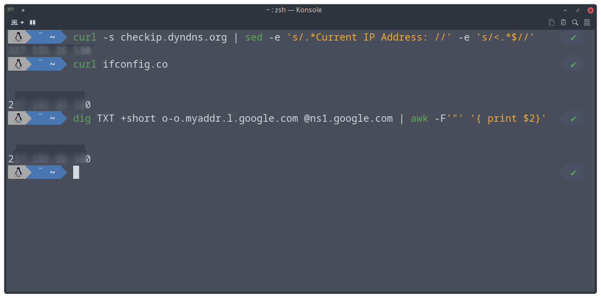

Aşağıda ki komutlar herhangi bir Linux sistemi için Linux Terminalinde harici IP'yi öğrenmenize yardımcı olur.<!--more-->

## Komutlar

### Dış IP için sorgu

`curl -s checkip.dyndns.org | sed -e 's/.*Current IP Address: //' -e 's/<.*$//'`

### Hatırlaması Basit ve Kısa olan yöntem

`curl ifconfig.co`

### Güvenlik kaygısı olanlar için curl kullanmadan yapılan sorgu

`dig TXT +short o-o.myaddr.l.google.com @ns1.google.com`

Bu komutlardan hepsi aynı sonuca ulaşacaktır, bu nedenle istediğinizi seçebilirsiniz. 
İş ve profesyonel ortamlarda kullanmak için **dig** ile sorgulamak daha güven verir. 
Bunu hatırlamak zor ise bir alias oluşturarak kolayca yapabilirsiniz.

`alias dip="dig TXT +short o-o.myaddr.l.google.com @ns1.google.com"`

Basit olan **curl ifconfig.co** komutu da işinizi görecektir.

