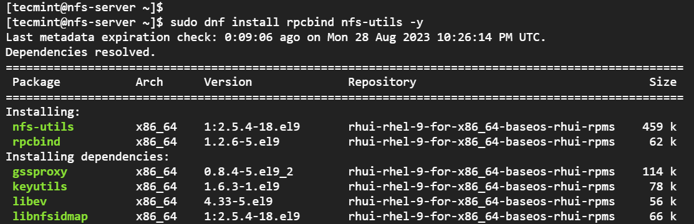

# Her Sistem Yöneticisinin Bilmesi Gereken 10 NMAP Komutu

Bir sistem yöneticisi olarak, araçlarınızı bilmek çok önemlidir ve akla ilk gelenlerden biri nmap'tir. Bu güçlü ağ tarayıcısı, basit bağlantı noktası taramasının ötesine geçer; güvenlik açıklarını, hizmet sürümlerini, işletim sistemlerini ve hatta ağınızda bulunan duyurulmamış yazıcıları keşfetmek için çok yönlü bir araçtır.

### 1. Alt Ağdaki IP'leri Keşfetme (root Erişimi Gerekmez)
Nmap'in basit ama etkili bir kullanımı, “ping taraması” olarak da bilinen alt ağ IP keşfidir. Komut oldukça basittir:
```console
$ nmap -sP 192.168.0.0/24
```
Bu komut, alt ağa çeşitli istekler göndererek yanıt veren IP'leri listeler. Bu komut kullanışlıdır ve kök erişimi gerektirmez, ancak kök kullanıcılar ek ARP istek yeteneklerine sahiptir.

2. Açık Portları Tarama (Kök Gerekmez)
Varsayılan nmap taraması açık portları ortaya çıkarır ve şu komutla yürütülür:
```console
$ nmap 192.168.0.0/24
```
Bu işlem, 1000 yaygın bağlantı noktasını taradığı ve DNS ters arama gibi ek kontroller yaptığı için zaman alıcı olabilir.

3. İşletim Sistemini Tanımlama (Kök Gerekiyor)
Daha derin bir analiz için nmap, -O seçeneği ile hedefin işletim sistemini tahmin edebilir:
```console
# nmap -O 192.168.0.164
```
Kök erişimi gerektiren bu özellik, bağlantı noktası taramalarından elde edilen bilgileri kullanarak işletim sistemi hakkında doğru tahminlerde bulunur.

4. Ana Bilgisayar Adlarını Tanımlama (Kök Gerekmez)
Aşağıdakini kullanarak tek tek ana bilgisayarlara paket göndermeden bir alt ağdaki ana bilgisayar adlarını ortaya çıkarın:
```console
$ nmap -sL 192.168.0.0/24
```
Bu ince komut, DNS sorguları gerçekleştirerek ağ yapısı ve cihaz rolleri hakkında bilgi sağlar.

5. TCP SYN ve UDP Taraması (Kök Gereklidir)
TCP ve UDP bağlantı noktaları için kapsamlı ancak gizli bir tarama şu komutla gerçekleştirilir:
```console
# nmap -sS -sU -PN 192.168.0.164
```
Bu tarama, zaman alıcı olsa da, kapsamlı bir ağ analizi için etkilidir.

6. Tam Aralık Port Taraması (Kök Gereklidir)
Mevcut tüm portlar (1–65535) üzerinde kapsamlı bir port taraması için şunu kullanın:
```console
# nmap -sS -sU -PN -p 1-65535 192.168.0.164
```
Bu komut, TCP SYN ve UDP taramasını tüm port aralığına genişletir.

7. TCP Bağlantı Taraması (Kök Gerektirmez)
SYN taramasından farklı olarak, TCP bağlantı taraması işletim sisteminden tam bir TCP bağlantısı kurmasını ister:
```console
$ nmap -sT 192.168.0.164
```
Bu tarama daha kolay tespit edilebilir, ancak kök ayrıcalıkları gerektirmez.

8. Agresif Tarama (Kök Gerektirir)
Detaylı ve agresif bir analiz için, bağlantı noktası, işletim sistemi ve hizmet taramalarını birleştirin:
```console
# nmap -A 192.168.0.164
```
Bu seçenek daha müdahaleci ve kolayca tespit edilebilir olduğundan, dikkatli bir şekilde kullanılmalıdır.

Unutmayın, nmap sorumlu bir şekilde kullanılması gereken güçlü bir araçtır. İster ağınızı güvenli hale getiriyor ister sorun giderme yapıyor olun, bu komutlar etkili ağ yönetimi için bir başlangıç noktası sunar. 

İyi taramalar!

